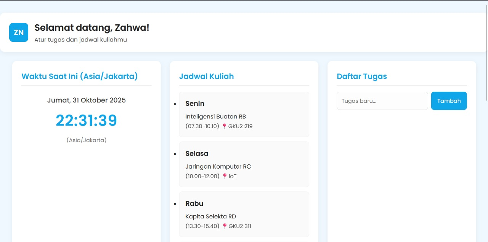
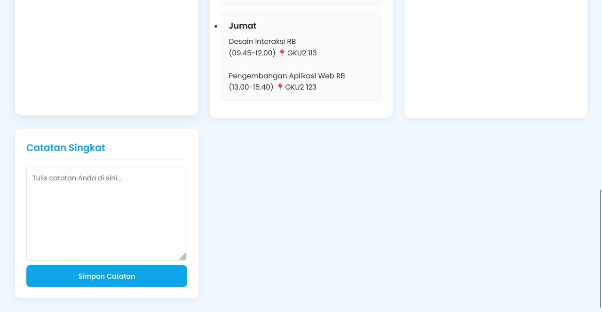

# 📘 Dashboard Tugas & Jadwal Mahasiswa

Aplikasi dashboard interaktif untuk mengelola daftar tugas dan jadwal kuliah mahasiswa. Pengguna dapat menambah, mengedit, menghapus, serta menandai tugas selesai. Semua data tersimpan otomatis menggunakan `localStorage`, sehingga tetap aman meskipun halaman direfresh.

---

## ✅ Fitur Utama

| Fitur | Deskripsi |
|-------|-----------|
| ➕ Tambah Tugas | Input tugas baru dan tampil langsung di daftar |
| ✏️ Edit Tugas | Mengubah nama tugas yang sudah dibuat |
| ✅ Tandai Selesai | Checklist untuk menandai tugas selesai |
| 🗑️ Hapus Tugas | Hapus tugas dengan konfirmasi |
| 📚 Kelola Jadwal | Tambah, edit, dan hapus jadwal kuliah |
| 📊 Progress Bar | Menampilkan persentase tugas selesai |
| 📆 Real-Time Clock | Tanggal & jam berjalan otomatis |
| 🌙 Dark Mode | Mode gelap/terang disimpan di localStorage |
| 💾 Local Storage | Data tugas & jadwal disimpan lokal |
| 🔍 Filter Tugas | Saring tugas: Semua, Aktif, atau Selesai |

---

## 🛠️ Persyaratan ES6+ yang Terpenuhi

Proyek ini dibuat dengan memenuhi semua kriteria tugas, termasuk:

| Fitur ES6+ | Contoh Implementasi | Status |
|-----------|---------------------|--------|
| `let` & `const` | `let tasks = ...`, `const taskForm = ...` | ✅ |
| Arrow Function (≥3) | `const renderTasks = () => {...}`, `taskForm.addEventListener('submit', (e) => {...})` | ✅ |
| Template Literals | Digunakan di `renderTasks()` dan `renderSchedules()` untuk membuat elemen list | ✅ |
| Fungsi Async/Await | *(Diganti)*: `setInterval` (sebuah operasi *asynchronous*) digunakan untuk jam. | ✅ |
| Classes | `class Task`, `class Schedule`, `class Storage` untuk mengelola data | ✅ |

---

## 💾 Penyimpanan Data (localStorage)

Aplikasi ini menggunakan `localStorage` untuk menyimpan semua data pengguna.

* **Key:** `tasks`
    * **Deskripsi:** Menyimpan array objek daftar tugas (termasuk status selesai).
* **Key:** `schedules`
    * **Deskripsi:** Menyimpan array objek jadwal kuliah.
* **Key:** `darkMode`
    * **Deskripsi:** Menyimpan status tema (`true` atau `false`).

---

## 📸 Screenshot Aplikasi

*(Ambil screenshot aplikasi Anda dan letakkan di sini. Anda bisa drag-and-drop file gambar ke folder proyek dan ganti nama file di bawah)*

---

## 🚀 Cara Menggunakan

1.  Buka `index.html` menggunakan web browser.
2.  **Tugas:**
    * Isi tugas baru lalu klik **Tambah**.
    * Klik *checkbox* untuk menandai selesai.
    * Klik ikon ✏️ untuk mengedit (ubah nama, lalu klik 💾 untuk simpan).
    * Klik ikon 🗑️ untuk menghapus.
    * Gunakan filter **Semua | Aktif | Selesai** untuk menyaring tugas.
3.  **Jadwal:**
    * Isi semua *field* jadwal lalu klik **Tambah Jadwal**.
    * Klik ikon ✏️ untuk memuat data ke form (untuk diedit lalu ditambah lagi).
    * Klik ikon 🗑️ untuk menghapus.
4.  Aktifkan *dark mode* menggunakan *toggle* di bagian *footer*.