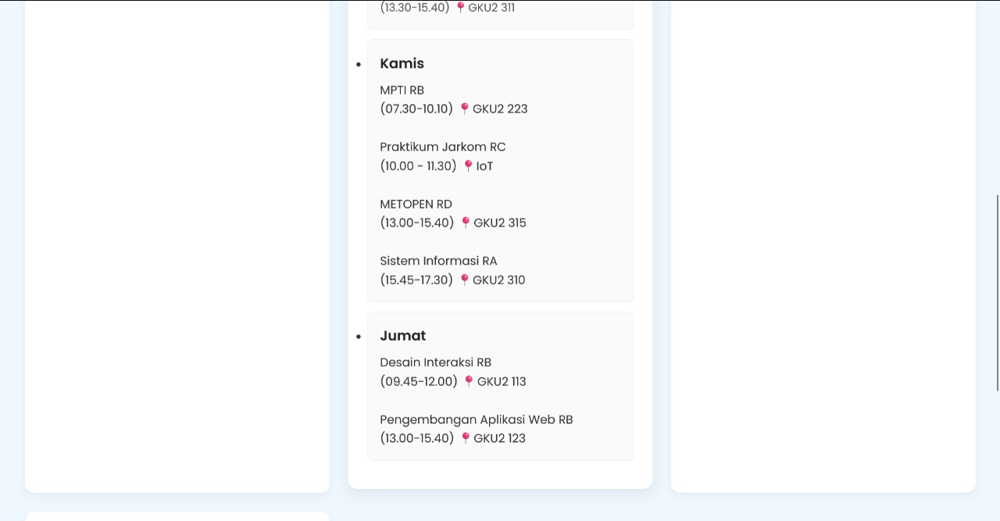

# 📘 Personal Dashboard Sederhana

Aplikasii dashboard personal sederhana untuk menampilkan jadwal kuliah, catatan, dan mengelola daftar tugas harian. Semua data interaktif (tugas dan catatan) disimpan menggunakan `localStorage`.

---

## ✅ Fitur Utama

| Fitur | Deskripsi |
|-------|-----------|
| 🙋 Header Personal | Menampilkan sapaan "Selamat datang, Zahwa!" |
| 📆 Real-Time Clock | Tanggal & jam berjalan otomatis (zona Asia/Jakarta) |
| 📚 Tampilan Jadwal | Menampilkan jadwal kuliah statis (hardcoded) |
| ➕ Tambah Tugas | Input tugas baru dan tampil langsung di daftar |
| 🗑️ Hapus Tugas | Menghapus tugas dari daftar |
| 📝 Catatan Singkat | Menyimpan dan memuat catatan teks dari `localStorage` |
| 💾 Local Storage | Data tugas & catatan disimpan secara lokal di browser |

---

## 💾 Penyimpanan Data (localStorage)

Aplikasi ini menggunakan `localStorage` untuk menyimpan data pengguna:

* **Key:** `daftarTugas`
    * **Deskripsi:** Menyimpan array objek daftar tugas yang dibuat pengguna.
* **Key:** `catatan`
    * **Deskripsi:** Menyimpan teks mentah dari widget Catatan Singkat.

---

## 📸 Screenshot Aplikasi

---

## 🚀 Cara Menggunakan

1.  Buka `index.html` menggunakan web browser.
2.  **Jadwal & Waktu** akan langsung tampil.
3.  **Daftar Tugas:**
    * Ketik tugas baru di *input field*.
    * Klik tombol **Tambah** untuk menyimpannya ke daftar.
    * Klik tombol **Hapus** pada tugas untuk menghilangkannya.
4.  **Catatan Singkat:**
    * Ketik apapun di *textarea*.
    * Klik tombol **Simpan Catatan** untuk menyimpannya ke `localStorage`. Catatan akan otomatis dimuat saat halaman dibuka kembali.
