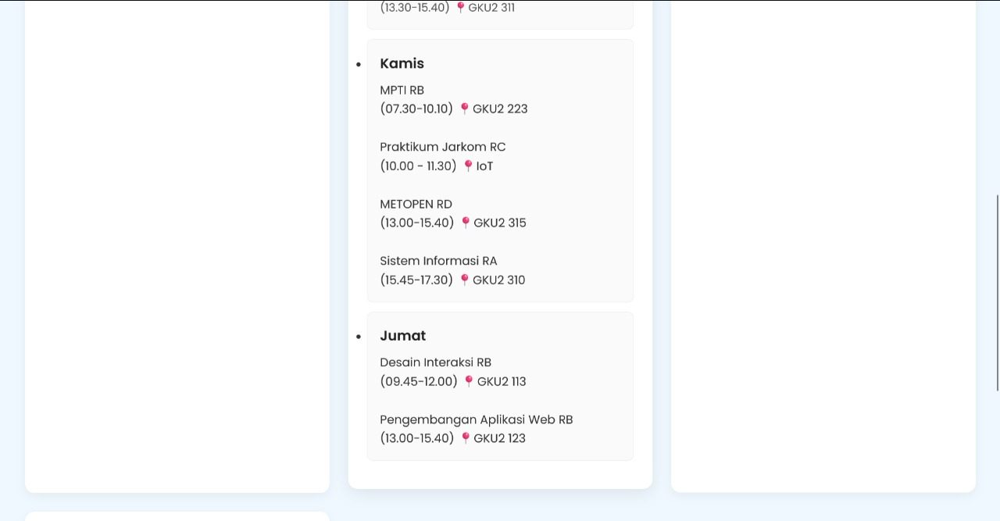
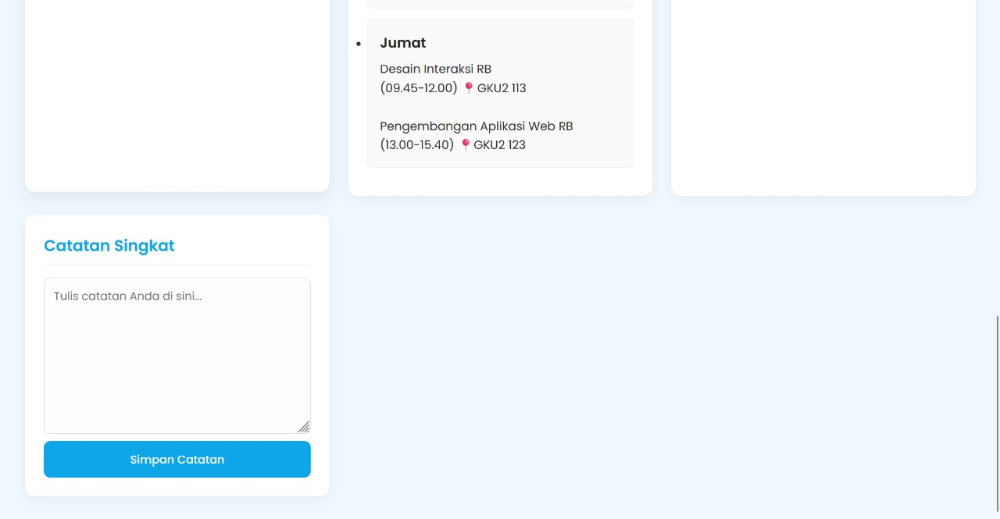

# Proyek Personal Dashboard Sederhana

Ini adalah proyek aplikasi web "Personal Dashboard" sederhana yang dibuat untuk memenuhi tugas mata kuliah. Aplikasi ini menampilkan informasi yang dipersonalisasi dan disimpan di browser pengguna.

## Fungsi dan Fitur Aplikasi

Aplikasi ini memiliki 4 widget utama:

1.  **Informasi Waktu:**
    * Menampilkan waktu (jam, menit, detik), tanggal, dan zona waktu (Asia/Jakarta) secara *real-time* dan terus berjalan.
    * Menggunakan `new Date()` dan `setInterval` untuk membuat jam dinamis.

2.  **Jadwal Kuliah:**
    * Menampilkan daftar jadwal kuliah yang sudah di-custom (bersifat statis/hanya tampilan).

3.  **Daftar Tugas (To-Do List):**
    * Fitur **Interaktif**: Pengguna dapat **menambah** tugas baru dan **menghapus** tugas yang sudah selesai.
    * Data tugas disimpan di **`localStorage`**, sehingga daftar tugas tidak akan hilang bahkan setelah browser ditutup.

4.  **Catatan Singkat:**
    * Fitur **Interaktif**: Pengguna dapat **menulis** dan **mengedit** catatan singkat.
    * Catatan disimpan secara otomatis di **`localStorage`** saat tombol "Simpan Catatan" diklik.

## Screenshot Aplikasi

## Daftar Fitur ES6+ yang Diimplementasikan

Sesuai persyaratan, proyek ini mengimplementasikan fitur-fitur ES6+ berikut:

1.  **`let` dan `const`:**
    * `const` digunakan untuk semua deklarasi variabel yang tidak akan di-reassign (misalnya, seleksi elemen DOM dan fungsi).
    * `let` digunakan untuk variabel yang nilainya berubah (misalnya, array `daftarTugas`).

2.  **Arrow Functions (`=>`):**
    * Digunakan secara ekstensif untuk semua fungsi *callback* dan fungsi utama (misalnya `renderTugas`, `tambahTugas`, `simpanCatatan`, `updateJam`, dll.) untuk sintaks yang lebih ringkas.

3.  **Template Literals (Backticks `` ` ``):**
    * Digunakan untuk rendering dinamis HTML di semua widget (Waktu, Jadwal, dan Daftar Tugas) agar lebih mudah dibaca daripada konkatenasi string.

4.  **Fungsi Asinkron (Async/Await):**
    * *(Catatan)*: Pada versi ini, kita menggunakan `setInterval` untuk fitur jam berjalan. Fitur ini memenuhi syarat penggunaan fungsi *asynchronous* (karena `setInterval` adalah *asynchronous*). Jika Anda **wajib** menggunakan kata kunci `async/await`, Anda bisa mengganti fungsi jam kembali ke versi awal (yang mengambil data dari API), namun jamnya tidak akan berdetak setiap detik.

5.  **Classes:**
    * Sebuah `class Tugas` dibuat untuk mendefinisikan *blueprint* atau struktur data dari setiap item tugas, yang berisi `id` dan `teks`.

